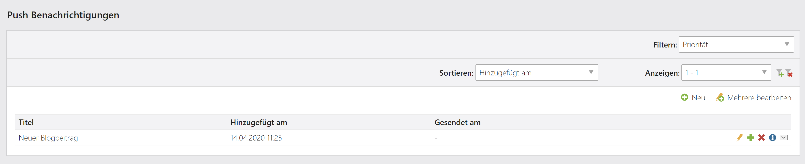
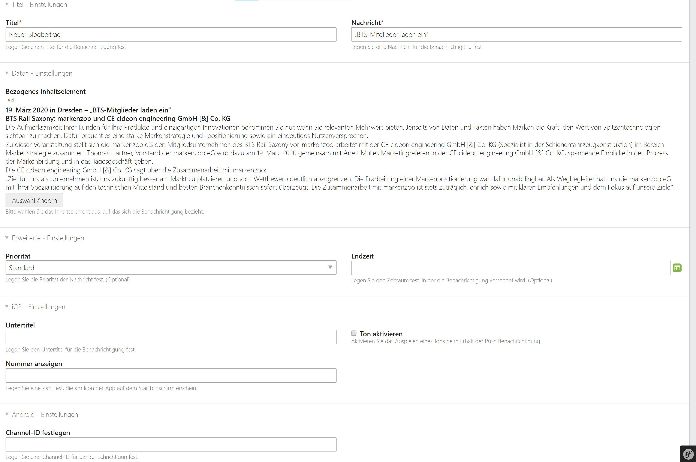
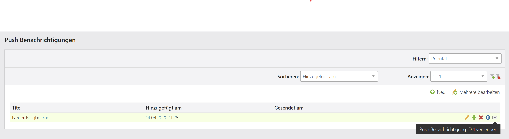
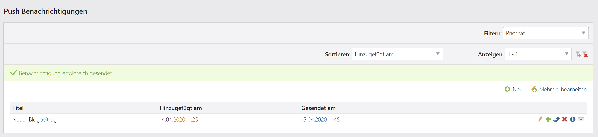

Contao Expo Push Notification Bundle
===============================


[](http://packagist.org/packages/markenzoo/contao-expo-push-notification-bundle)
[](https://github.com/markenzoo/contao-expo-push-notification-bundle/issues)
[](http://packagist.org/packages/markenzoo/contao-expo-push-notification-bundle)
[](https://travis-ci.org/markenzoo/contao-expo-push-notification-bundle)
[](http://packagist.org/packages/markenzoo/contao-expo-push-notification-bundle)

This extension provides a Contao CMS integration of push notifications for [React Native](https://reactnative.dev/) using [Expo](https://expo.io/).

Features
--------

This extension for Contao 4.9 (and above) allows user to incooperate a Contao Backend into a mobile app made with react native and expo.
Upon start of the mobile app a user will register against a backend service with a notification token. 
This token will then be used to trigger custom push notifications from the Contao Backend on the device.
For further information see: [here](https://docs.expo.io/versions/latest/guides/push-notifications/)
 
Requirements
------------

 - PHP >7.1
 - Contao ~4.9 LTS
 
 
Install
-------

### Managed edition

When using the managed edition it's pretty simple to install the package. Just search for the package in the
Contao Manager and install it. Alternatively you can use the CLI.  

```bash
# Using the contao manager
$ php contao-manager.phar.php composer require markenzoo/contao-expo-push-notification-bundle

# Using composer directly
$ php composer.phar require markenzoo/contao-expo-push-notification-bundle

# Using global composer installation
$ composer require markenzoo/contao-expo-push-notification-bundle
```

### Symfony application

If you use Contao in a symfony application without contao/manager-bundle, you have to register the bundle manually:

```php

class AppKernel
{
    public function registerBundles()
    {
        $bundles = [
            // ...
            new Markenzoo\ContaoExpoPushNotificationBundle\ContaoExpoPushNotificationBundle()
        ];
    }
}

```

Quickstart
-------

In order to send a push notification to a mobile app, providers need to identify your device with Apple and Google through the Expo push token. This token is unique and generated each time the app is installed on a device. So all we need to do is send this token to our Contao installation so we can use it in the future for sending push notifications.

<p align="center">
    
</p>

This extensions for Contao provides a [Controller](https://github.com/markenzoo/contao-expo-push-notification-bundle/blob/master/src/Controller/ExpoPushNotificationController.php) which handles requests to store a token in the database used by your Contao installation. The table used for storing tokens is called `tl_expo_push_notification_token`. All you need to do is to send a `POST`-Request to the Endpoint `https://your-server.com/api/notifications` with the token from your mobile app. (Where "https://your-server.com" is the domain of your website and /api/notifications is the endpoint of the above mentioned controller.)

Take for example the following implementation and store it in a file called `pushNotificationsAsync.js`.
Remember to replace "https://your-server.com" with the domain of your website.

```javascript
import { Notifications } from 'expo';
import * as Permissions from 'expo-permissions';

const PUSH_ENDPOINT = 'https://your-server.com/api/notifications';

export default async function registerForPushNotificationsAsync() {
  const { status: existingStatus } = await Permissions.getAsync(Permissions.NOTIFICATIONS);
  let finalStatus = existingStatus;

  // only ask if permissions have not already been determined, because
  // iOS won't necessarily prompt the user a second time.
  if (existingStatus !== 'granted') {
    // Android remote notification permissions are granted during the app
    // install, so this will only ask on iOS
    const { status } = await Permissions.askAsync(Permissions.NOTIFICATIONS);
    finalStatus = status;
  }

  // Stop here if the user did not grant permissions
  if (finalStatus !== 'granted') {
    return;
  }

  // Get the token that uniquely identifies this device
  let token = await Notifications.getExpoPushTokenAsync();

  // POST the token to your backend server from where you can retrieve it to send push notifications.
  return fetch(PUSH_ENDPOINT, {
    method: 'POST',
    headers: {
      Accept: 'application/json',
      'Content-Type': 'application/json',
    },
    body: JSON.stringify({
      token: {
        value: token,
      }
    }),
  });
}
```

---

Push Notifications are send via a plain old HTTP Request. In fact, you could simply write your one command line tool to send them if you want to.
For this purpose, `markenzoo/contao-expo-push-notification-bundle` internally uses the [solvecrew/expo-notifications-bundle](https://github.com/solvecrew/ExpoNotificationsBundle). 
The benefit this extensions for Contao CMS provides, is that you can send them directly from your Contao Backend and enrich them with data from your Contao installation. Expo will do all the heavy lifting and execute the push notification on the different providers, namely Apple Push Notification service (APNs) for iOS and Firebase Cloud Messaging for Android.


<p align="center">
    
</p>

**Note**:
For Android, you'll also need generate a Firebase Cloud Messaging server key and upload it to Expo so that Expo can send notifications to your app. **This step is necessary** unless you are not creating your own APK and using just the Expo client app from Google Play. To do so, follow the guide on [Using FCM for Push Notifications](https://docs.expo.io/versions/latest/guides/using-fcm/) to learn how to create a Firebase project, get your FCM server key, and upload the key to Expo. 

---

You can send Push Notifications by navigating to `Push Notifications in the Contao Backend`.

<p align="center">
    
</p>
<p align="center">
    
</p>
<p align="center">
    
</p>
<p align="center">
    
</p>

---

You will no receive push notifications on your mobile app, which will appear in the system notification tray as you've come to expect, and tapping them will open/foreground the app. If your notifications are purely informational and you have no desire to handle them when they are received or selected, you're already done. 

But Expo provides the capabilities to do much more! Maybe you want to update the UI based on the notification, or maybe navigate to a particular screen if a notification was selected. All you need to do is add a listener using the Notifications API. You can take e.g. the following implementation.

```javascript
import React from 'react';
import { Notifications } from 'expo';
import { Text, View } from 'react-native';

// This refers to the function defined earlier
import registerForPushNotificationsAsync from './pushNotificationsAsync';

export default class AppContainer extends React.Component {
  state = {
    notification: {},
  };

  componentDidMount() {
    registerForPushNotificationsAsync();

    // Handle notifications that are received or selected while the app
    // is open. If the app was closed and then opened by tapping the
    // notification (rather than just tapping the app icon to open it),
    // this function will fire on the next tick after the app starts
    // with the notification data.
    this.notificationSubscription = Notifications.addListener(this.handleNotification);
  }

  handleNotification = notification => {
    this.setState({ notification: notification });
  };

  render() {
    return (
      <View style={{ flex: 1, justifyContent: 'center', alignItems: 'center' }}>
        <Text>Origin: {this.state.notification.origin}</Text>
        <Text>Data: {JSON.stringify(this.state.notification.data)}</Text>
      </View>
    );
  }
}
```

**That's it !** 🎉

### Further Reading

- [Expo Documentation](https://docs.expo.io/versions/latest/guides/push-notifications/)

### Note to self

Run the PHP-CS-Fixer and the unit test before you release your bundle:

```bash
$ composer run-script fix
$ composer run-script test
$ composer run-script lint
$ composer run-script lint:fix
```